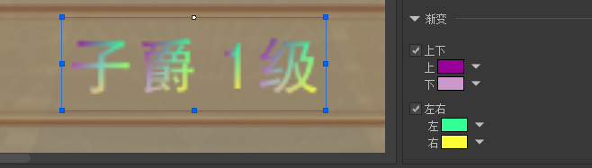
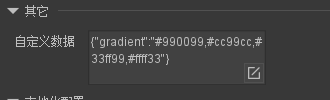
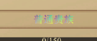

# fairygui_plugin_gradient_text

## 插件说明

fairygui 插件设置渐变色  

编辑器部分基于wxb1990的[fairygui_plugin_gradient_text](https://github.com/wxb1990/fairygui_plugin_gradient_text)插件魔改而成。

运行时代码请拷贝本文档底部代码或参考其自行实现。

支持组件类型如下：

- text
- richtext
- inputtext
- Button
- Label

## 编辑器使用说明

1. 选中组件，在右侧`检查器`面板中可以看到`渐变`一栏，根据自己需求勾选`上下`或`左右`渐变（可都勾选）

2. 设置颜色值后将立即生效，其将影响两处内容：

   1. 编辑器中文本的预览颜色

      

   2. 自定义数据中会生成对应的json字段（供运行时使用）

      

## 运行时代码

首先我们需要对`GTextField`添加属性和相关方法供外部设置渐变色:

```csharp
namespace FairyGUI
{
    /// <summary>
    /// 
    /// </summary>
    public class GTextField : GObject, ITextColorGear
    {
        // 其他代码忽略
        
        /// <summary>
        /// 渐变色
        /// </summary>
        public Color32[] gradientColor
        {
            get => _textField.textFormat.gradientColor;
            set
            {
                var tf = _textField.textFormat;
                
                if (value == null)
                {
                    if (tf.gradientColor == null)
                        return;
                    
                    tf.gradientColor = null;
                }
                else if (tf.gradientColor == value)
                {
                    // do nothing
                }
                else if (tf.gradientColor == null)
                {
                    tf.gradientColor = new Color32[4];
                    value.CopyTo(this.gradientColor, 0);
                }
                else
                {
                    value.CopyTo(this.gradientColor, 0);
                }
                
                _textField.textFormat = tf;
                UpdateGear(4);
            }
        }
        
        /// <summary>
        /// 设置四方向渐变色
        /// </summary>
        public void UpdateGradientColor(Color32 top, Color32 bottom, Color32 left, Color32 right)
        {
            var tf = _textField.textFormat;

            var buffer = tf.gradientColor ??= new Color32[4];
            buffer[0] = top;
            buffer[1] = bottom;
            buffer[2] = left;
            buffer[3] = right;
            
            this.gradientColor = buffer;
        }
        
        /// <summary>
        /// 设置从上到下的渐变色
        /// </summary>
        public void UpdateVerticalGradientColor(Color32 top, Color32 bottom)
        {
            UpdateGradientColor(top, bottom, top, bottom);
        }
        
        /// <summary>
        /// 设置从左到右的渐变色
        /// </summary>
        public void UpdateHorizontalGradientColor(Color32 left, Color32 right)
        {
            UpdateGradientColor(left, left, right, right);
        }
    }
}
```

添加上述代码后，GTextField就允许通过代码直接设置渐变色了，然后我们在相关组件构造时，读取自定义数据，用于还原编辑器中设置的渐变色：

1. 新增工具类`UIUtils`

```csharp
namespace FairyGUI.Utils
{
    public static class UIUtils
    {
        private const string JSON_KEY = "gradient";
        private static readonly Regex REGEX = new Regex(@"#([A-Fa-f0-9][A-Fa-f0-9])([A-Fa-f0-9][A-Fa-f0-9])([A-Fa-f0-9][A-Fa-f0-9])");
        
        /// <summary>
        /// 初始化文本渐变色
        /// </summary>
        public static void SetupGradientText(GTextField textField, Dictionary<string, object> jsonObject)
        {
            if (textField == null)
                return;
            
            if (jsonObject == null || !jsonObject.TryGetValue(JSON_KEY, out var jsonValue) || !(jsonValue is string str))
                return;

            var colors = REGEX.Matches(str);
            if (colors.Count != 4)
                return;

            var top = ParseColor32(colors[0]);
            var bottom = ParseColor32(colors[1]);
            var left = ParseColor32(colors[2]);
            var right = ParseColor32(colors[3]);
            
            textField.UpdateGradientColor(top, bottom, left, right);
        }

        private static Color32 ParseColor32(Match match)
        {
            var r = byte.Parse(match.Groups[1].Value, System.Globalization.NumberStyles.HexNumber);
            var g = byte.Parse(match.Groups[2].Value, System.Globalization.NumberStyles.HexNumber);
            var b = byte.Parse(match.Groups[3].Value, System.Globalization.NumberStyles.HexNumber);
            return  new Color32(r, g, b, 255);
        }
    }
}
```

2. 在相关组件的`Setup_AfterAdd`方法中进行初始化:

```csharp
namespace FairyGUI
{
    public class GObject
    {
        // 省略原有代码
        
        public Dictionary<string, object> dataJsonObject
        {
            get
            {
                if (_hasDeserializeDataJsonObject)
                    return _dataJsonObject;
                
                _hasDeserializeDataJsonObject = true;

                var dataStr = data as string;
                if (string.IsNullOrEmpty(dataStr))
                    return null;

                try
                {
            		// 这里的dataJsonObject需要大家用自己的json库将data反序列化
                    _dataJsonObject = JsonUtils.ParseJson(dataStr);
                }
                catch (Exception)
                {
                    // ignore
                    _dataJsonObject = null;
                }

                return _dataJsonObject;
            }
        }
    }
    
    // 由于GRichTextField和GTextInput均继承自GTextField 所以无需重复执行
    public class GTextField : GObject, ITextColorGear
    {
        // 省略原有代码
        
        override public void Setup_AfterAdd(ByteBuffer buffer, int beginPos)
        {
            base.Setup_AfterAdd(buffer, beginPos);

            // 省略原有代码
            
            UIUtils.SetupGradientText(this, dataJsonObject);
        }
    }
    
    
    public class GButton : GComponent, IColorGear
    {
        // 省略原有代码
        
        override public void Setup_AfterAdd(ByteBuffer buffer, int beginPos)
        {
            base.Setup_AfterAdd(buffer, beginPos);

            // 省略原有代码
            
            UIUtils.SetupGradientText(GetTextField(), dataJsonObject);
        }
    }
    
    
    public class GButton : GComponent, IColorGear
    {
        // 省略原有代码
        
        override public void Setup_AfterAdd(ByteBuffer buffer, int beginPos)
        {
            base.Setup_AfterAdd(buffer, beginPos);

            // 省略原有代码
            
            UIUtils.SetupGradientText(GetTextField(), dataJsonObject);
        }
    }
    
}
```

3. 然后运行游戏，即可看到在编辑器中设置的渐变色文本了：

   
